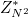

# CCA-Secure Proxy Re-Encryption without Pairings∗ 
à

In uno schema proxy re-encryption, un proxy di "terze parti" di "fiducia" può trasformare un ciphertext firmato dalla chiava pubblica, pb, di Alice in un altro
ciphertext che Bob può decifrare. Si osservi che il proxy non ha accesso al plaintext. Grazie a questa proprietà, lo schema proxy re-encryption può essere
usato in molte applicazioni come le email cifrate. In questo progetto rappresenta l'applicazione delloschema proxy re-encryption senza pairings, usando la conversione Fijasaki-Okamoto e la "signature of knowledge", inoltre il proxy può solamente trasformare il ciphertext in modalità *one direction*. Questo
schema si propone come uno schema sicuro in senso CCA e resistente alle collisioni  sul modello *random oracle* supposto che il problema decisionale Diffie-Hellman (DDH) in  sia difficile e sia computazionalmente difficile anche il problema della fattorizzazione. Quindi questo schema di presenta, fino ad ora, il primo schema PRE unidirezionale sicuro in senso CCA e resistente alle collisioni.

## Getting Started
These instructions will get you a copy of the project up and running on your local machine for development and testing purposes. See deployment for notes on how to deploy the project on a live system.


### Prerequisites
 pachetti da installare per utilizzare il progetto
 
```
[ The GNU Multiple Precision Arithmetic library ](https://gmplib.org/)
[ Text for the link ](URL)
[Nettle: a low-level cryptographic library](https://www.lysator.liu.se/~nisse/nettle/)
[PBC Library: the Pairing-Based Cryptography library](https://crypto.stanford.edu/pbc/)
 

```

### Installing


A step by step series of examples that tell you how to get a development env running

Say what the step will be


```

Give the example

```


And repeat


```

until finished

```


End with an example of getting some data out of the system or using it for a little demo


## Running the tests


Explain how to run the automated tests for this system


### Break down into end to end tests


Explain what these tests test and why


```

Give an example

```


### And coding style tests


Explain what these tests test and why


```

Give an example

```


## Deployment


Add additional notes about how to deploy this on a live system


## Authors


* **Billie Thompson** - *Initial work* - [PurpleBooth](https://github.com/PurpleBooth)


See also the list of [contributors](https://github.com/your/project/contributors) who participated in this project.


## License


Questo progetto usa la MIT License - vedi[LICENSE.md](LICENSE.md) file for details


